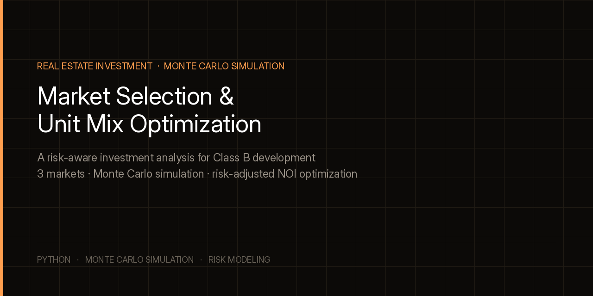
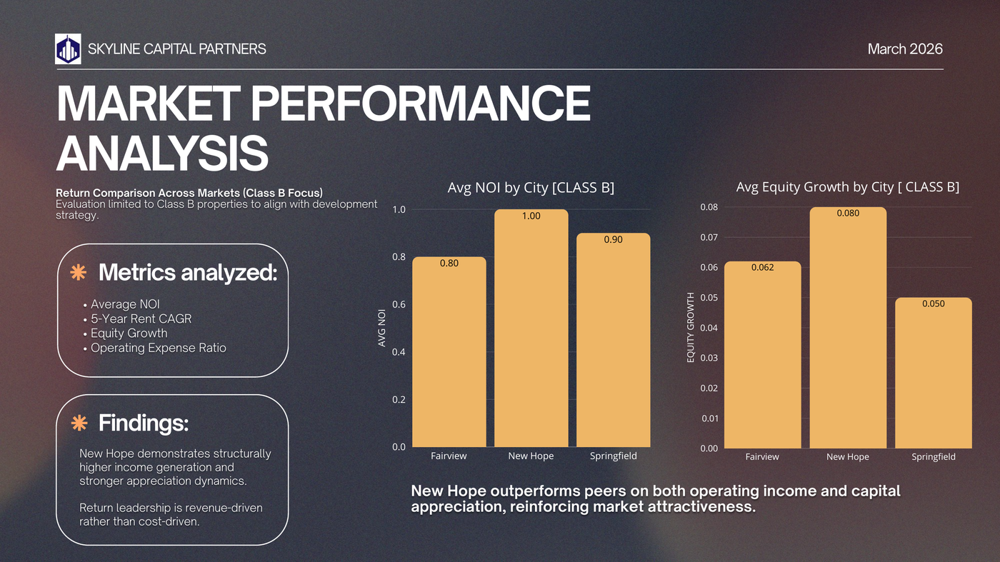
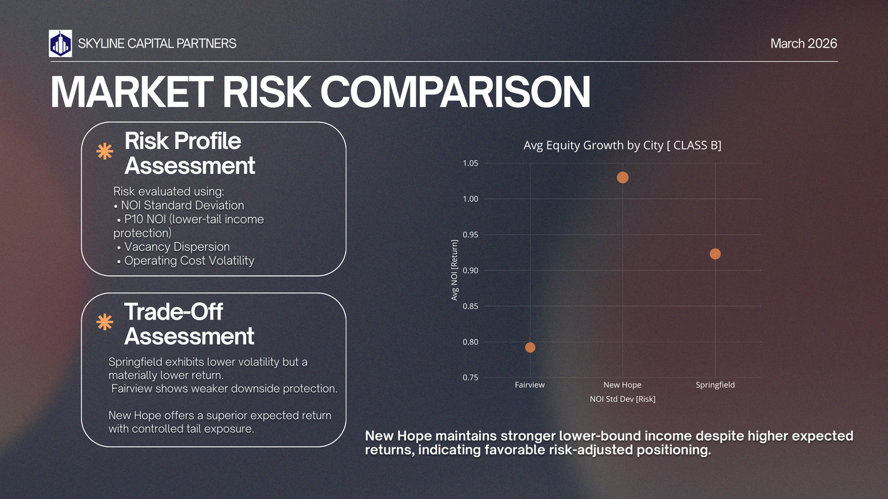
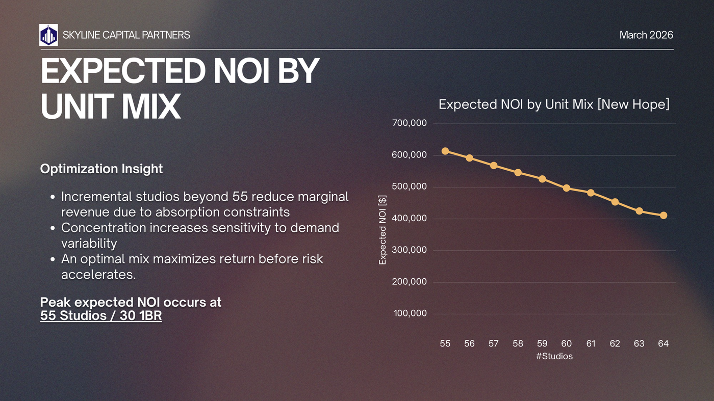
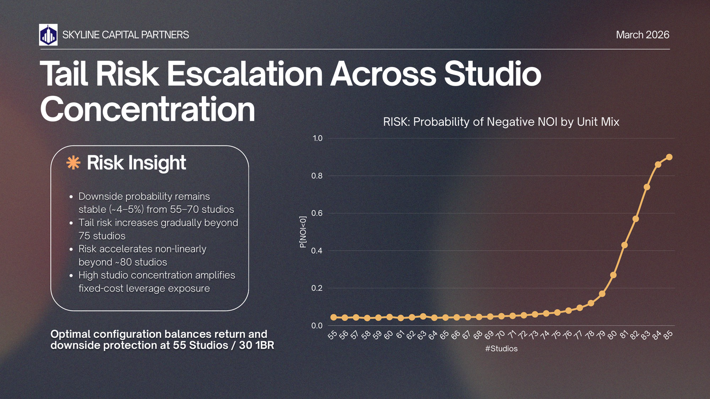
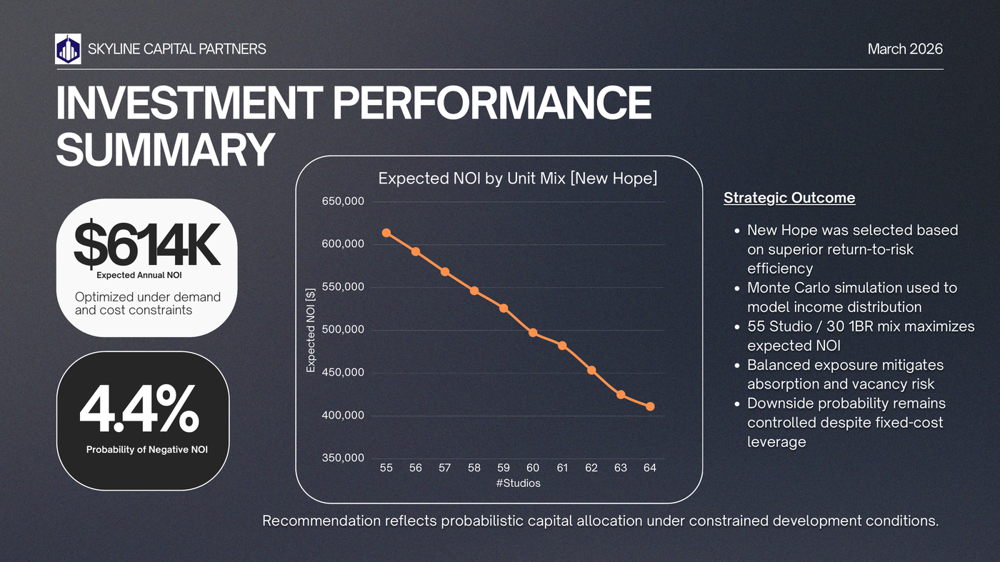

<div align="center">



[](https://www.python.org/)
[](https://en.wikipedia.org/wiki/Monte_Carlo_method)

</div>

# Market Selection & Unit Mix Optimization

> A risk-aware investment analysis for Class B multifamily development, built for a simulated capital partner.

**Strategic objective:** identify the optimal market and unit configuration that maximizes risk-adjusted Net Operating Income (NOI) under realistic demand, cost, and absorption uncertainty. The goal isn't the configuration that looks best in a single best-case projection.

---

## The Problem

A development team is evaluating where to build a Class B multifamily property and how to split the unit mix between studios and one-bedroom units, under fixed constraints: an 85-unit cap, an 80,000 sq ft footprint, and a $320K fixed operating cost structure. Three candidate markets were under consideration: Fairview, New Hope, and Springfield.

A single-scenario projection can make almost any market or unit mix look reasonable. The point of this analysis is to instead simulate a full distribution of outcomes for each option, so the recommendation reflects downside risk, not just an expected-case number.

---

## Approach: Monte Carlo Simulation

Rather than modeling one projected outcome, a Monte Carlo simulation was built across all feasible unit mixes under the given constraints, incorporating:

- Rent variability
- Vacancy fluctuations
- Cost-structure rigidity (fixed vs. variable costs)
- Demand-absorption limits (rent-based caps on how quickly units lease)

This produces a full output distribution per configuration rather than a single number, from which four metrics were extracted for every candidate:

- **Expected NOI**: the average outcome across simulation runs
- **Standard Deviation**: volatility of NOI across runs
- **P10 NOI**: the 10th-percentile outcome, meaning downside protection
- **Probability of Negative NOI**: how often a configuration loses money across simulated conditions

---

## Market Comparison

Evaluation was limited to Class B properties across all three markets, using average NOI, 5-year rent CAGR, equity growth, and operating expense ratio.



New Hope led on both operating income (avg NOI of 1.00 vs. 0.80 for Fairview and 0.90 for Springfield) and equity growth (0.080 vs. 0.062 and 0.050). That return leadership was revenue-driven rather than cost-driven, which matters. New Hope isn't winning by cutting corners on expenses. It's winning by generating more income per property.



On risk: Springfield showed lower volatility but at a materially lower return. Fairview showed weaker downside protection than either alternative. New Hope offered the strongest expected return with controlled tail exposure. It wasn't just the highest-return option; it was the highest-return option that didn't require accepting outsized downside risk to get there.

**Why not the alternatives:**
- **Fairview** underperforms on both expected return and lower-tail protection. That eliminates it under a disciplined investment mandate; there's no scenario where it's the better choice.
- **Springfield** trades return for a marginal stability gain that isn't worth the capital efficiency cost. It's a stability-heavy, return-light profile that doesn't clear the bar.

---

## Unit Mix Optimization

Within the selected market (New Hope), expected NOI was simulated across unit mixes ranging from 55 to 85 studio units, with the remainder as one-bedroom units, subject to the square footage constraint.



Expected NOI peaks at **55 studios / 30 one-bedroom units** and declines steadily as studio concentration increases beyond that point. Every additional studio past 55 reduces marginal revenue, because the absorption constraint caps how quickly units can actually be leased. More units doesn't help if they can't be filled at a competitive rent.



The risk picture reinforces the same conclusion from a different angle. Downside probability (chance of negative NOI) stays flat around 4-5% from 55 to roughly 70 studios, then climbs gradually, then accelerates sharply past ~80 studios. High studio concentration doesn't just erode expected return. It disproportionately amplifies fixed-cost leverage risk once absorption can't keep pace with unit count.

---

## Recommendation



**Proceed with development in New Hope, at a 55 Studio / 30 One-Bedroom configuration.**

- Expected annual NOI: **≈ $614K**
- P10 NOI (downside protection): **≈ $495K**
- Probability of negative NOI: **4.4%**
- NOI standard deviation: **≈ $221K**

This configuration sits at the point where expected return is maximized before risk begins accelerating. It's not the point of highest possible unit count, and it's not the point of lowest possible risk. It's the point where the trade-off between the two is most favorable.

---

## Tools & Technologies

| Category | Tools |
|---|---|
| Simulation | Python, Monte Carlo methods |
| Analysis | Risk-adjusted return metrics (expected value, standard deviation, percentile/tail analysis) |
| Presentation | Executive-level slide narrative for a capital partner audience |

---

## Project Structure

```
real-estate-investment-analysis/
│
├── banner.png
├── images/
│   └── [analysis slide exports]
└── README.md
```

---

## About

Tanya Patel is an MS Business Analytics Candidate at Simon Business School, University of Rochester (December 2026).

[LinkedIn](https://www.linkedin.com/in/tanyapatel23/) | [Email](mailto:tpatel18@simon.rochester.edu)
